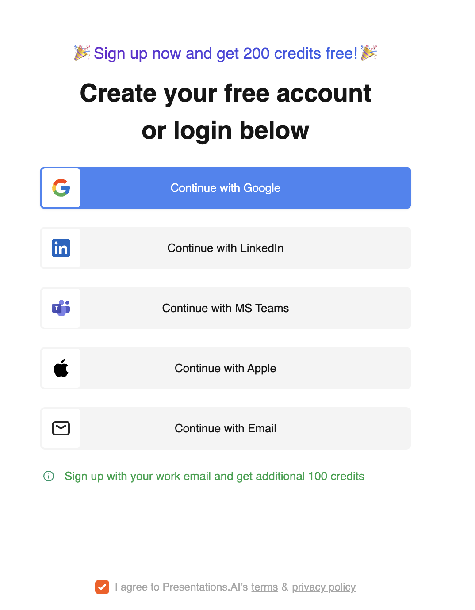
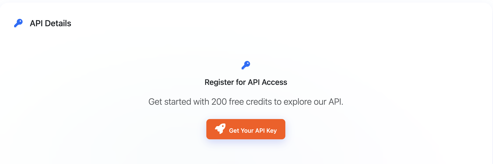
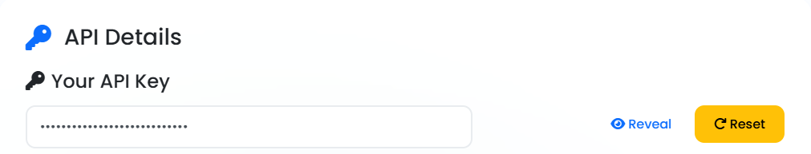

# ⚡ Quick Start Guide

Get up and running with Presentations.AI in under 10 minutes! This guide will walk you through creating your first AI-generated presentation.

!!! tip "🎯 What You'll Learn"
    - Account setup and API key generation
    - Your first API call
    - Understanding responses and next steps
    - Testing with different programming languages

---

## 🚀 **Step 1: Create Your Account**

1. **Visit** [{{ config.extra.developer_url_login }}]({{ config.extra.developer_url_login }})
2. **Sign up** using:
   - LinkedIn, Google, or Microsoft (instant access)
   - Email (requires email confirmation)
3. **Complete** the registration process



!!! success "✅ Free Credits"
    New accounts receive **200 free credits** to get started!

---

## 🔑 **Step 2: Get Your API Key**

1. **Navigate** to **Settings → API / Register for API**
2. **Click** "Register for API" button
3. **Click** "Reveal" to display your API key
4. **Copy** and store your API key securely



!!! warning "🔒 Security Note"
    Never commit API keys to version control or share them publicly. Store them as environment variables or in secure configuration.



---

## 🎯 **Step 3: Make Your First API Call**

Let's create a simple presentation about "AI in Healthcare":

### Using cURL:
```bash
curl -X POST {{ config.extra.developer_url }}/api/v1/topic/document \
  -H "Authorization: Bearer YOUR_API_KEY_HERE" \
  -H "Content-Type: application/json" \
  -d '{
    "topic": "AI in Healthcare: Transforming Patient Care",
    "slideCount": 6,
    "language": "en", 
    "domain": "presentations.ai",
    "exportType": "ppt"
  }'
```

### Using JavaScript (Node.js):
```javascript
const axios = require('axios');

const createPresentation = async () => {
  try {
    const response = await axios.post('{{ config.extra.developer_url }}/api/v1/topic/document', {
      topic: "AI in Healthcare: Transforming Patient Care",
      slideCount: 6,
      language: "en",
      domain: "healthcare", 
      exportType: "ppt"
    }, {
      headers: {
        'Authorization': 'Bearer YOUR_API_KEY_HERE',
        'Content-Type': 'application/json'
      }
    });
    
    console.log('Success:', response.data);
    return response.data;
  } catch (error) {
    console.error('Error:', error.response.data);
  }
};

createPresentation();
```

### Using Python:
```python
import requests
import json

def create_presentation():
    url = "{{ config.extra.developer_url }}/api/v1/topic/document"
    
    headers = {
        "Authorization": "Bearer YOUR_API_KEY_HERE",
        "Content-Type": "application/json"
    }
    
    data = {
        "topic": "AI in Healthcare: Transforming Patient Care",
        "slideCount": 6,
        "language": "en",
        "domain": "presentations.ai",
        "exportType": "ppt"
    }
    
    try:
        response = requests.post(url, headers=headers, json=data)
        response.raise_for_status()
        
        result = response.json()
        print("Success:", json.dumps(result, indent=2))
        return result
        
    except requests.exceptions.RequestException as e:
        print(f"Error: {e}")

create_presentation()
```

---

## 🎉 **Step 4: Understanding the Response**

A successful response looks like this:

```json
{
    "status": 0,
    "docid": 199943,
    "docurl": "{{ config.extra.docurl }}/exports/199943/1755583984885/Digital%20Marketing%20for%20Small%20Businesses.pptx",
    "animated_url": "https://devcdn.presentations.ai/exports/199943/1755583984566/Digital%20Marketing%20for%20Small%20Businesses_animated.pptx"
}
```

### Response Fields:
- **`status`**: `0` = success, `1` = error
- **`message`**: Human-readable status message  
- **`docurl`**: Direct link to view/edit your presentation
- **`insertid`**: Unique presentation ID for future operations

!!! success "🎊 Congratulations!"
    Click the `docurl` to view your AI-generated presentation!

---

## 🔧 **Step 5: Try Different Export Types**

Presentations.AI supports multiple export formats:

### PowerPoint File (.ppt):
```json
{
  "topic": "Your topic here",
  "exportType": "ppt"
}
```

### PowerPoint File (.pptx):
```json
{
  "topic": "Your topic here",
  "exportType": "pptx"
}
```

### PDF Document:
```json
{
  "topic": "Your topic here", 
  "exportType": "pdf"
}
```

### Web Shareable Link:
```json
{
  "topic": "Your topic here",
  "exportType": "share"
}
```

### Preview Images:
```json
{
  "topic": "Your topic here",
  "exportType": "image"
}
```

---

## 🌍 **Step 6: Explore Language Support**

Create presentations in multiple languages:

```json
{
  "topic": "Inteligencia Artificial en la Medicina",
  "language": "es",
  "domain": "presentations.ai"
}
```

**Supported Languages:**
- `en` - English
- `es` - Spanish  
- `fr` - French
- `de` - German
- `pt` - Portuguese
- `it` - Italian
- And many more...

---

## 🎯 **Step 7: Customize by Domain**

Get better results by specifying the domain context:

=== "Business"
    ```json
    {
      "topic": "Digital Marketing Strategy 2024",
      "domain": "yourdomain.com",
      "slideCount": 12
    }
    ```

=== "Education"
    ```json
    {
      "topic": "Introduction to Quantum Physics", 
      "domain": "education",
      "slideCount": 15
    }
    ```

=== "Technology"
    ```json
    {
      "topic": "Cloud Computing Fundamentals",
      "domain": "presentations.ai", 
      "slideCount": 10
    }
    ```

=== "Healthcare"
    ```json
    {
      "topic": "Patient Safety Protocols",
      "domain": "presentations.ai",
      "slideCount": 8
    }
    ```

---

## ❌ **Common Errors & Solutions**

### Authentication Error (401):
```json
{
  "status": 1,
  "error": "Unauthorized access"
}
```
**Solution**: Check your API key and Authorization header format.

### Insufficient Credits (402):
```json
{
  "status": 1, 
  "error": "Insufficient credits"
}
```
**Solution**: [Purchase more credits]({{ config.extra.developer_portal }}) or check your balance.

### Invalid Topic (400):
```json
{
  "status": 1,
  "error": "Topic cannot be empty"
}
```
**Solution**: Ensure your topic is descriptive and not empty.

---

## 🚀 **Next Steps**

Congratulations! You've successfully created your first AI presentation. Here's what to explore next:

1. **[API Reference](v1/topic-document.md)** - Explore all available endpoints
2. **[MCP Integration](mcp-v1/create-document-from-content.md)** - Connect with Claude Desktop
3. **[Best Practices](#)** - Tips for optimal results

!!! tip "💡 Pro Tips"
    - Use specific, descriptive topics for better results
    - Start with smaller slide counts (5-10) to test
    - Specify domain context for more relevant content
    - Save your `insertid` for future slide updates

---

**Ready to build something amazing?** 🎨

[Explore Full API Documentation](v1/topic-document.md){ .md-button .md-button--primary }
[Get Support](mailto:support@presentations.ai){ .md-button }